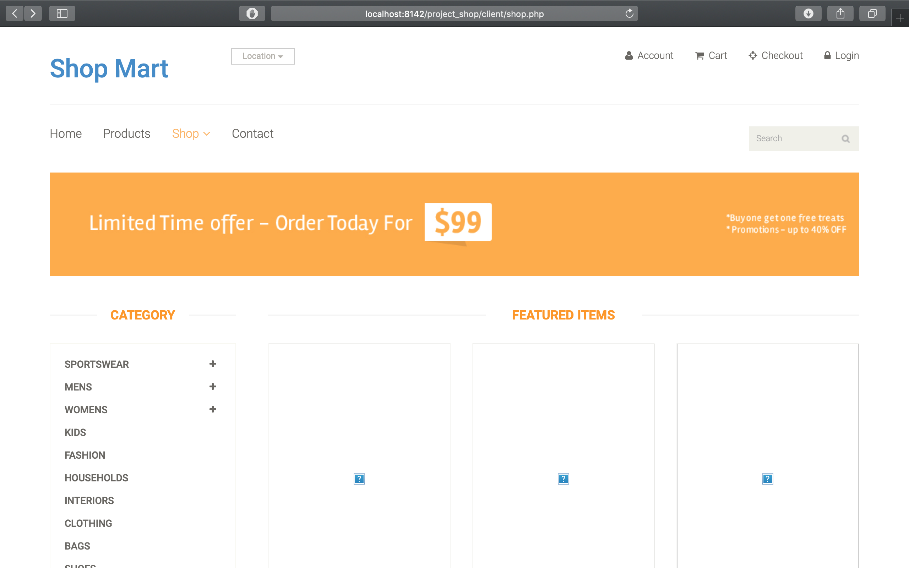
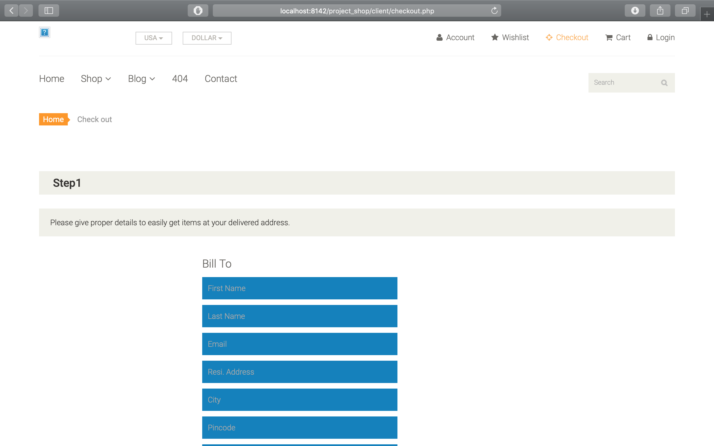
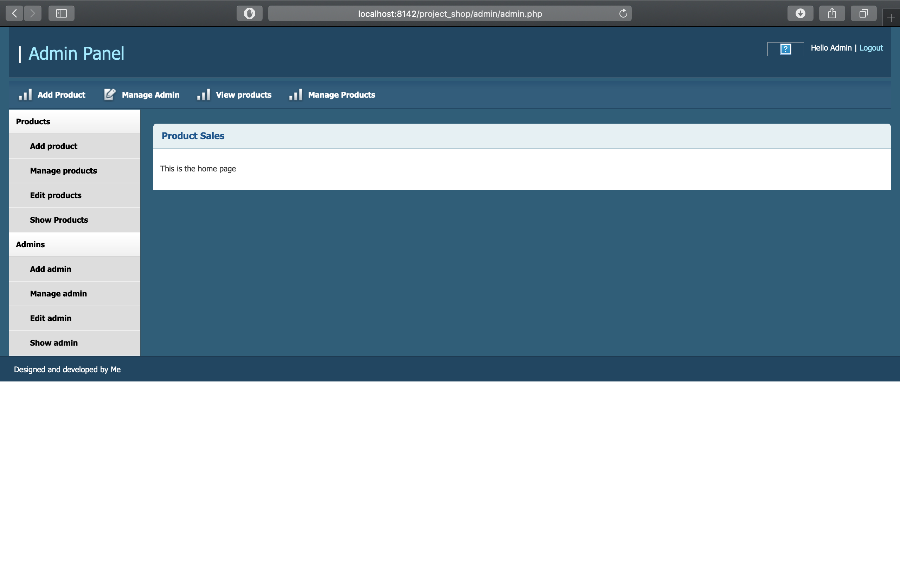
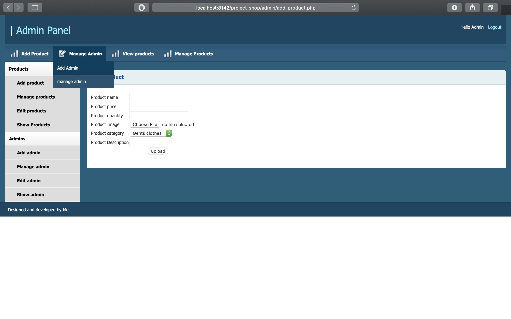
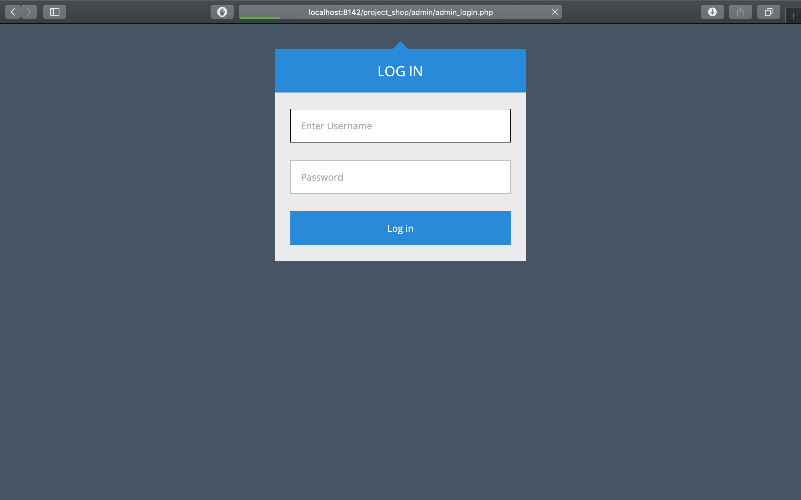

# project_shop
This is a shopping cart in PHP.
 
It has both an admin and client side.
 
 
Admin:<b>
Login 
Can upload Products from admin panel with images so as to view them in the client side. 
Can manage users 
Display orders 

 
Client: 
Login and sign up 
Can View products 
Add to cart 
Checkout 
Add order information  

##Screenshots

